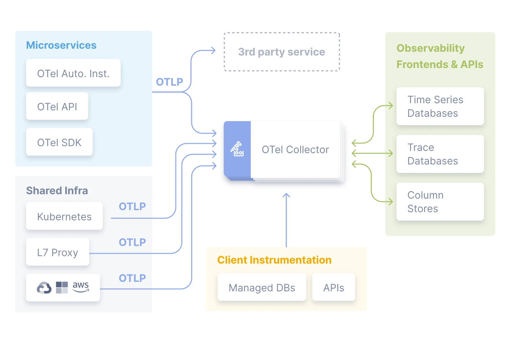

  

    
    <h2>Projeto de Arquitetura e ETL</h2>
  

## 1 - Introdução

A [ImpulsoGOV](https://www.impulsogov.org/) é uma organização de tecnologia do terceiro setor que faz uso inteligente de dados para transformar a saúde pública do Brasil.

[🎯 Desafio original](https://impulsogov.notion.site/Case-CTO-885231d00e494dc5bd2332f1053d3cbd)

## 2 - Mapeamento de componentes do sistema:

  

    🔧 &nbsp; Back-end & ETL - Arquitetura Atual</a>
  

- **Linguagem:** `Python`
- **Framework:** `FastAPI`

### Processo de ETL:

- O `transmissor` atual é um `conector do Postgres` aplicado ao banco de dados do município.
- `Conexão direta` entre o `transmissor` e o `banco de dados analítico` da ImpulsoGov.
- Uma `procedure` no `banco do município` executa `consultas` em tabelas locais e `insere` os resultados no banco de dados analítico.

### Banco do Município:

- Propriedade e gestão pertencentes ao próprio município.
- - Localizado em servidores locais ou em nuvem.
- - Variações na presença de pessoal de TI.
- Todos os municípios possuem um banco `padrão acoplado` ao `PEC (Software do SUS)`, resultando em uma modelagem consistente.

### Rotina de Transmissão:

- `Diariamente`, no início da manhã, iniciam-se os processos de transmissão.
- - Geralmente, no início da tarde, todos os dados do dia são recebidos.
- A instalação do transmissor é de responsabilidade da ImpulsoGov.

---

#### 🏗️ &nbsp; 2.1 - Modelagem do Domínio (DDD - Domain Driven Design)

  

    Entidades Principais
  

&nbsp;

| Entidades Principais | Definições                                                                                                                                                   |
| -------------------- | ------------------------------------------------------------------------------------------------------------------------------------------------------------ |
| ImpulsoGov           | Responsável pela lógica de aplicação, incluindo o Backend (Python com FastAPI), Processo de ETL, Rotina de Transmissão e Instalação do Transmissor.          |
|                      | `Agregados`: Backend (Python, FastAPI), Processo de ETL (Transmissor, Banco do Município, Rotina de Transmissão), Banco do Município, Rotina de Transmissão. |
|                      | `Objetos de Valor`: Conexão Direta, Procedure no Banco do Município, Modelagem Consistente.                                                                  |

  

    Contextos Delimitados
  

&nbsp;

| Contextos Delimitados | Definições                                                                                                                                                                   |
| --------------------- | ---------------------------------------------------------------------------------------------------------------------------------------------------------------------------- |
| ImpulsoGov            | Desenvolvimento do `Backend` em `Python` com `FastAPI`, Processo de `ETL` (Extração, Transformação e Carregamento), Rotina de `Transmissão` e `Instalação` do `Transmissor`. |
| Banco do Município    | Gerencia propriedade, localização e variações de pessoal de TI nos bancos municipais.                                                                                        |
| Rotina de Transmissão | Define os processos `diários` de `transmissão` de dados.                                                                                                                     |

  

    Glossário
  

&nbsp;

|     | **Termo Técnico**                   | **Explicação Técnica**                                                                              | **Contexto ImpulsoGov**                                                                              |
| --- | ----------------------------------- | --------------------------------------------------------------------------------------------------- | ---------------------------------------------------------------------------------------------------- |
| 🔍  | **Entidades**                       | Objetos identificáveis e fundamentais para o domínio, mantendo uma existência ao longo do tempo.    | A `Entidade Backend` é central no sistema.                                                           |
| 🔄  | **Agregados**                       | Agrupamentos de entidades e objetos de valor para garantir consistência no domínio.                 | O `Processo de ETL` é um agregado com `Transmissor`, `Banco do Município` e `Rotina de Transmissão`. |
| 📦  | **Objetos de Valor**                | Objetos sem identidade própria, definidos por atributos, trazendo valor pela composição.            | Exemplo de objeto de valor é a `Conexão Direta`.                                                     |
| 🌐  | **Contextos Delimitados**           | Áreas do domínio com regras específicas, onde termos têm significados isolados.                     | Dentro do `Banco do Município`, estabelecemos nossas próprias regras.                                |
| 💻  | **Backend**                         | Lógica de aplicação, processamento de dados e interação com o usuário.                              | Nosso `Backend` é desenvolvido em `Python` com `FastAPI`.                                            |
| 🔄  | **Processo de ETL**                 | Atividades de Extração, Transformação e Carregamento de dados entre sistemas ou bancos de dados.    | O `Transmissor` é crucial no `Processo de ETL`.                                                      |
| 📡  | **Transmissor (Postgres)**          | Componente que extrai dados de um banco PostgreSQL e os transmite para outro local.                 | O `Transmissor` conecta o `Banco do Município` ao `Banco Analítico`.                                 |
| 🔄  | **Procedure no Banco do Município** | Rotina armazenada no banco de dados que executa consultas e insere resultados.                      | As `Procedures` no `Banco do Município` manipulam dados no `Banco Analítico`.                        |
| 🏗️  | **Modelagem Consistente**           | Abordagem para manter um padrão uniforme na estrutura e design dos dados.                           | Garantimos uma `Modelagem Consistente` em todos os `Bancos do Município`.                            |
| 🔗  | **Conexão Direta**                  | Estabelecimento de uma ligação direta entre dois componentes para transferência eficiente de dados. | A `Conexão Direta` entre o `Transmissor` e os `Bancos` garante transferência eficiente.              |

---

#### 🔄 &nbsp; 2.2 - Digrama de Sequência

```mermaid

sequenceDiagram
  participant Transmissor
  participant BancoMunicipio
  participant BancoAnalitico

  Transmissor ->> BancoMunicipio: Conectar ao BancoMunicipio
  activate BancoMunicipio

  Transmissor ->> BancoMunicipio: Executar consulta em tabelas locais
  note over BancoMunicipio: Procedure no BancoMunicipio

  BancoMunicipio -->> Transmissor: Resultados da consulta

  Transmissor ->> BancoAnalitico: Conectar ao BancoAnalitico da ImpulsoGov
  activate BancoAnalitico

  Transmissor ->> BancoAnalitico: Inserir resultados no BancoAnalitico
  note over BancoAnalitico: Transformação e carga de dados

  BancoAnalitico -->> Transmissor: Confirmação de carga

  deactivate BancoMunicipio
  deactivate BancoAnalitico

```

#### 🧐 &nbsp; 2.3 - Análise Crítica e Identificação de Riscos

> 📢 Nota: Avaliação realizada exclusivamente com base nas informações e tecnologias fornecidas durante os processos de entrevistas com [Pedro Drummond](https://www.linkedin.com/in/pedro-drummond/) e [Gabrielle Arruda](https://www.linkedin.com/in/gabrielle-arruda/).
>
> 👌 Boa parte das justificativas se devem a escolha do `PostgreSQL` e das [funcionalidades que ele carrega](https://www.postgresql.org/about/featurematrix/) em relação a outros bancos de dados opensource.

  

    🌟 Postgres - Destaques
  

&nbsp;

- [x] O PostgreSQL adota o `Multi-Version Concurrency Control (MVCC)`, que possibilita operações `concorrentes eficientes`, importante no processamento de grandes volumes de dados dos municípios que exijam escrita e leitura (nas transformações) da `instância analítica` sem `locks`, garantindo isolamento transacional e consistência nos resultados.
- [x] Suporte a tipos de dados avançados dando mais felxibilidade em transformações complexas durante as etapas de ETL.
- [x] Desempenho robusto. É capaz de lidar eficientemente com `grandes volumes` de dados.
- [x] O suporte completo a `transações ACID` (Atomicidade, Consistência, Isolamento e Durabilidade), incluindo o `MVCC`, assegura uma recuperação consistente em situações de falhas.

| **Aspecto**                 | **Vantagens**                           | **Pontos de Atenção**                                 | **Validações**                                                                                                                                                                                          | **Mitigação de Risco**                                                                                                                                                                           | **Sugestões**                                                                                                                                                                       |
| --------------------------- | --------------------------------------- | ----------------------------------------------------- | ------------------------------------------------------------------------------------------------------------------------------------------------------------------------------------------------------- | ------------------------------------------------------------------------------------------------------------------------------------------------------------------------------------------------ | ----------------------------------------------------------------------------------------------------------------------------------------------------------------------------------- |
| ğŸ›¡ï¸ **Segurança da Conexão** | 🚀 Conexão rápida                       | 🔠Segurança                                          | ✅ Validar tempos de resposta para garantir eficiência.    ✅ Auditar configurações de segurança, incluindo autenticação e criptografia.    ✅ Implementar monitoramento em tempo real. | 📋 Reforçar segurança por meio de patches contínuos.                                                                                                                                             | 👉 Implementar autenticação e criptografia _OAuth2_ e _JWT_.    👉 Configurar alertas automáticos para monitoramento contínuo com RapidAPI.                                 |
|                             | 📊 Padronização: Facilita manutenção.   | 🛑 Variação de Pessoal de TI: Pode afetar segurança.  | ✅ Revisar documentação para garantir conformidade.    ✅ Implementar treinamentos remotos para padronização.    ✅ Monitorar atividades e fornecer suporte técnico remoto.             | 📋 Estabelecer diretrizes claras para segurança consistente.    📋 Oferecer treinamento remoto adicional, se necessário.                                                                 | 👉 Criar documentação técnica com exemplos de segurança usando FastAPI.    👉 Oferecer webinars ou tutoriais online para treinamento remoto.                                |
| 🚀 **Desempenho**           | 🔄 Atualização Diária: Processo eficaz. | ⚠️ Possíveis Gargalos: Risco de eficiência.           | ✅ Realizar testes de carga para identificar gargalos.    ✅ Monitorar tempos de processamento diário.    ✅ Implementar técnicas de otimização.                                        | 📋 Avaliar e implementar soluções escaláveis.    📋 Explorar ferramentas avançadas de monitoramento para identificar gargalos.                                                           | 👉 Utilizar índices eficientes no PostgreSQL para otimizar recuperação de dados.    👉 Explorar ferramentas de otimização de consulta para melhor desempenho do PostgreSQL. |
|                             | 🚀 Eficiência com Grandes Dados.        | 🌠Impacto na Infraestrutura: Pode afetar desempenho. | ✅ Realizar testes de desempenho com grandes volumes de dados.    ✅ Monitorar tempos de resposta em diferentes ambientes.    ✅ Estabelecer diretrizes claras.                         | 📋 Investir em análise de infraestrutura em municípios com variações significativas.    📋 Considerar caches locais para melhor eficiência no processamento de grandes volumes de dados. | 👉 Utilizar técnicas de particionamento no PostgreSQL para otimizar consultas em grandes volumes de dados.    👉 Explorar índices adequados para consultas frequentes.      |

- O **FastAPI** tem suporte nativo para [Prometheus](https://prometheus.io/) para coletar métricas de desempenho `PromQL`, latência e etc, integradas às visualizações do [Grafana](https://grafana.com/) - [Exemplo:](https://dev.to/ken_mwaura1/getting-started-monitoring-a-fastapi-app-with-grafana-and-prometheus-a-step-by-step-guide-3fbn).

- **OpenTelemetry** poderia ser usado para instrumentalização e integração
  
